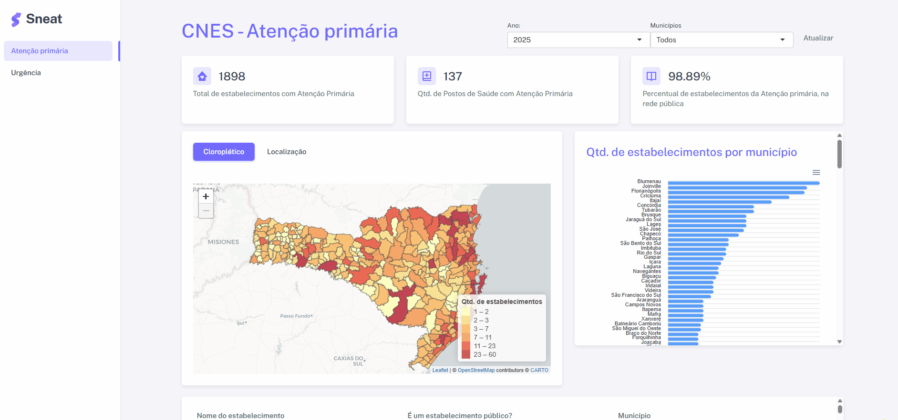

# Urgency and primary care facilities

> A shiny app built using [golem](https://thinkr-open.github.io/golem/) framework and [*sneat*](https://github.com/themeselection/sneat-bootstrap-html-admin-template-free) template from *theme selection*. The data used here was obtained from national registry of healthcare facilities (CNES), available by DATASUS [here](ftp://ftp.datasus.gov.br/cnes). You can view a live example by following this [link](http://142.93.67.223/shiny/shiny_cns/).

### TODO's

The purpose of this repository is only to share code to others R Shiny developers. There are some bugs that i`ll fix over time

- [ ] Extract and add data from API googlemaps
- [ ] Share the code used to extract and tidy CNES data
